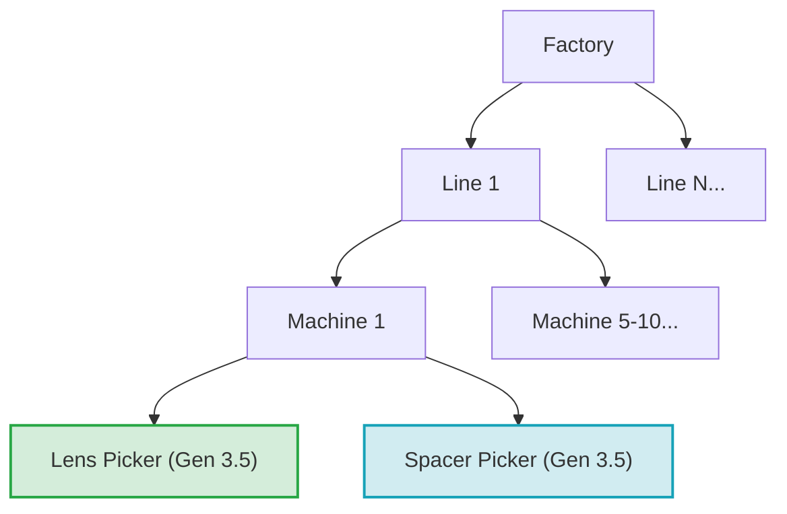
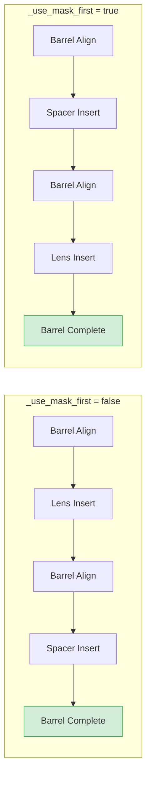
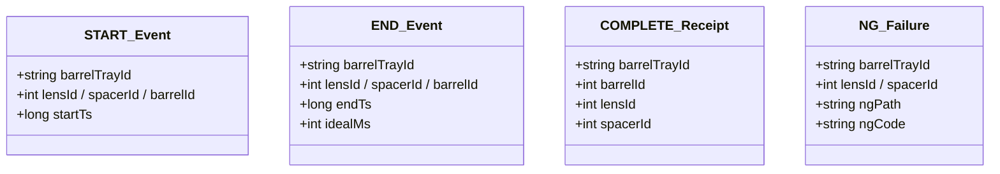
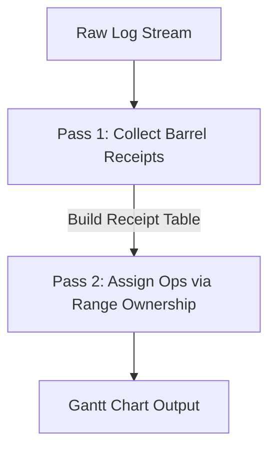
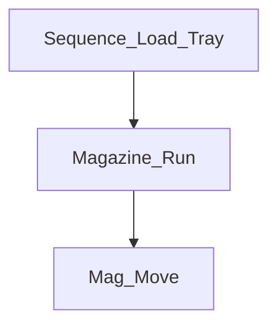
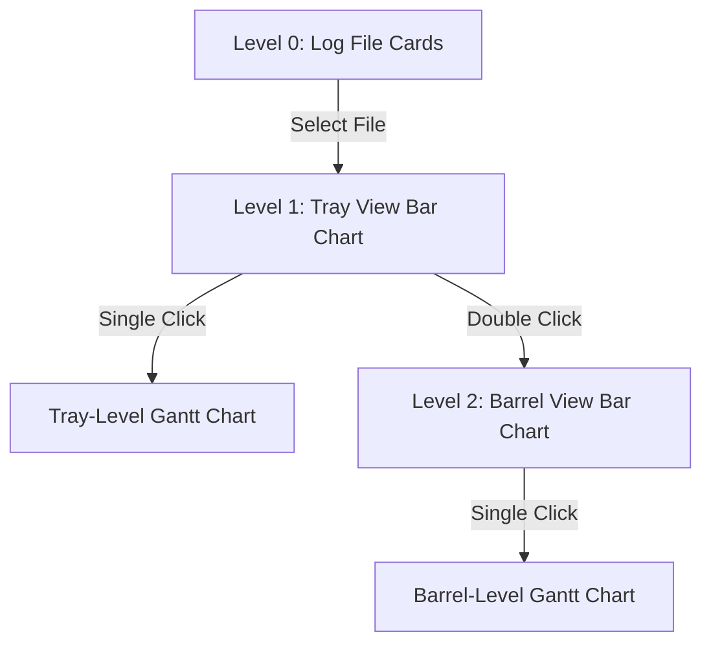
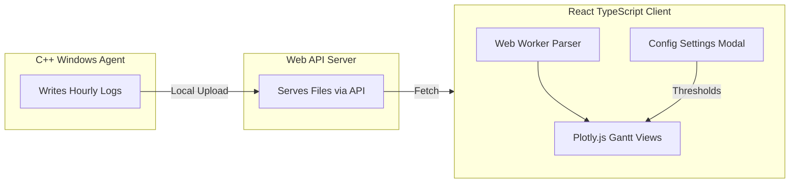

# Lens Log Analyzer — Complete Understanding Document

> [!NOTE]
> **Purpose**: Single source of truth consolidating ALL confirmed decisions, architecture, and requirements. This document serves as the visual foundation for the Log Analyzer implementation.

---

## 1. Physical Machine Context

### 1.1 Factory & Machine Hierarchy

The factory is organized hierarchically. In Gen 3.5, each machine contains two parallel pickers.



### 1.2 Process Flow & Dimensions
- **Machine Operation**: Assembles **barrels** by inserting a **lens** and a **spacer** into each barrel slot on a **barrel tray**.
- **Dimensions**:
  | Component | Source / Feeder | Max Dimensions | Notes |
  | :--- | :--- | :--- | :--- |
  | **Barrel Tray** | Pallet / Conveyor | **11 × 11 = 121 barrels** | Dimensions are variable per model. |
  | **Lens Tray** | Separate Tray Feeder | Larger than Barrel Tray | One barrel tray consumes **multiple** lens trays. |
  | **Spacer** | Feeder Mechanism | N/A | No tray concept (continuous feeder). |

---

### 1.3 Assembly Modes (`_use_mask_first` flag)

The C++ parser determines the sequence order strictly from log timestamps. The field names remain identical.



---

### 1.4 Pipelined Parallel Execution

The Lens Picker and Spacer Picker work in parallel. Components for **Barrel N+1** are pre-fetched while **Barrel N** is still being assembled.

```mermaid
gantt
    title Pipelined Execution Parallelism
    dateFormat  X
    axisFormat %s
    
    section Barrel 0 (Assembly)
    Barrel Align (Lens)     :active, b0_1, 0, 10
    Lens Insert             :active, b0_2, 10, 20
    Barrel Align (Spacer)   :active, b0_3, 20, 30
    Spacer Insert           :active, b0_4, 30, 40
    Complete                :milestone, b0_5, 40, 40
    
    section Barrel 1 (Pre-fetch)
    Lens Tray Align         :crit, b1_1, 10, 20
    Lens Pickup             :crit, b1_2, 20, 30
    Lens Align              :crit, b1_3, 30, 40
    Barrel Align (Lens)     :active, b1_4, 40, 50
```



> [!IMPORTANT]
> Because of parallel pre-fetching, **Lens Prep operations for Barrel N+1 start BEFORE Barrel N+1's `Barrel_Align_Lens` START**. Our mapping algorithm must account for this overlap.

---

## 2. Log File Structure

### 2.1 File Parameters
- **Path**: `C:\LAI\LAI-WorkData\Log\General\{YYYY}\{MM}\{DD}\{YYYYMMDDHH}_GeneralLog.log`
- **Rotation**: Hourly files (approx. **5 MB** each after filtering)
- **Format**: Tab-Separated Values (TSV)

### 2.2 Column Layout & Row Selection

```
┌────────────────────────────────────────────────────────────────────────────────────────┐
│ Col 0: Wall Timestamp │ Col 1: EQP ID │ Col 2: Picker ID │ ... │ Col 7: Scope │ Col 8: Op Name │
└────────────────────────────────────────────────────────────────────────────────────────┘
                                                                     │
                                                                     ▼
                                                      Filter Key: "Seq_Log_Analyzer"
```

> [!TIP]
> Filter strictly on **Col 7 = `Seq_Log_Analyzer`**. 
> Note that Col 0 (wall-clock) is for logging reference only; **all duration calculations must use `startTs`/`endTs` from the JSON payload** (Col 10).

---

## 3. JSON Metadata Schema & Flow

### 3.1 Generic Schema Layout



> [!IMPORTANT]
> **Schema Details**:
> - `barrelTrayId` format is `"YYYYMMDD_HHMMSS"` (quoted string).
> - `startTs` and `endTs` are raw milliseconds since LAI application startup (high-resolution counter). No time-sync or epoch normalization is required; candle size naturally renders elapsed time.

---

## 4. Counter Strategies & Lifecycles

```mermaid
stateDiagram-v2
    state "lensId Counter" as C1 {
        [*] --> Monotonic1 : Never Resets
        Monotonic1 --> Monotonic1 : Across Tray & Barrel boundaries
    }
    state "spacerId Counter" as C2 {
        [*] --> Monotonic2 : Never Resets
        Monotonic2 --> Monotonic2 : Increments monotonically
    }
    state "barrelId Counter" as C3 {
        [*] --> Resets : Starts at 0
        Resets --> Resets : Increments inside Tray
        Resets --> [*] : CSeqBarrel::FinishTray() (Resets to 0)
    }
```

---

## 5. Two-Pass Barrel Mapping Algorithm

Because pre-fetched operations cross physical boundaries, we use a **two-pass mapping algorithm** based on the `Sequence_Barrel_Complete` receipt.



### 5.1 Step-by-Step Mapping Strategy

1. **Pass 1: Extract Receipts**
   Identify all `Sequence_Barrel_Complete SET` events and map IDs:
   | barrelId | lensId | spacerId |
   | :---: | :---: | :---: |
   | **0** | 0 | 0 |
   | **1** | 2 | 1 |
   | **2** | 4 | 2 |

2. **Pass 2: Range Ownership Rules**
   Assign operations to Barrel $N$ based on ownership boundaries:
   - **Lens Ops**: `[prevBarrel.lensId + 1 ... thisBarrel.lensId]` (e.g., Barrel 1 owns Lens 1 & 2)
   - **Spacer Ops**: `[prevBarrel.spacerId + 1 ... thisBarrel.spacerId]`
   - **Barrel Ops**: Direct 1:1 match using `barrelId`

---

## 6. Sub-Operation Tree Hierarchy

Col 8 contains `/`-delimited names to allow unlimited nested trees.



> [!TIP]
> The parser splits Col 8 by `/` and automatically builds an N-level hierarchy tree. This ensures **zero code changes** on the UI side when the C++ team logs deeper steps.

---

## 7. Interactive Drill-Down UI Architecture

The UI consists of **two tabs**: **Barrel-wise** (default) and **Long Gantt** (tray timeline).



### 7.1 UX Features & Customization
- **Tab Configurations**:
  - **Barrel-wise**: Interactive bar charts + operation details.
  - **Long Gantt**: Restricted to **one selected tray** (max 121 barrels) for fluid UI performance.
- **Dynamic Heat Coloring**:
  - <span style="color:green">●</span> **Green**: Duration < User Configured Ideal Time.
  - <span style="color:red">●</span> **Red**: Duration $\ge$ User Configured Ideal Time.
  - Thresholds are custom-set via a **UI Settings Modal** (saved in `localStorage`).

---

## 8. Complete Sequence & Operations Dictionary

### 8.1 Active Sequences in Logs
| Component | Sequence Name | Event Type | Purpose / Description |
| :--- | :--- | :---: | :--- |
| **Barrel** | `Sequence_Barrel_Align_Lens` | START / END | Prep alignment before Lens Insert. |
| **Barrel** | `Sequence_Barrel_Align_Mask` | START / END | Prep alignment before Spacer Insert. |
| **Receipt**| `Sequence_Barrel_Complete` | SET | Triggers Pass 1 Mapping (holds lens/spacer IDs). |
| **Lens** | `Sequence_Lens_Tray_Align` | START / END / SET | Inspection on lens tray (captures NG failures). |
| **Lens** | `Sequence_Lens_Pickup` | START / END | Mechanical pick of lens from tray. |
| **Lens** | `Sequence_Lens_Align` | START / END | Vision camera alignment. |
| **Lens** | `Sequence_Lens_Insert` | START / END | Placement of lens into barrel. |
| **Spacer** | `Sequence_Mask_Pickup` | START / END | Mechanical pick of spacer from feeder. |
| **Spacer** | `Sequence_Mask_Align` | START / END | Under-vision spacer alignment check. |
| **Spacer** | `Sequence_Mask_Insert` | START / END | Placement of spacer into barrel. |

### 8.2 Future Sequences (UI Ready)
- `Sequence_Load_Tray` (`lensTrayId`)
- `Sequence_Unload_Tray` (`lensTrayId`)
- `Sequence_Pallet_In` (`barrelTrayId`)
- `Sequence_Pallet_Out` (`barrelTrayId`)

---

## 9. Component Architecture



---

## 10. Verified C++ Fixes & Validations

### 10.1 Key Bug Squashes

```mermaid
map
    "Out-of-Bounds Barrel" : "Moved StartTime() after bounds check in CSeqBarrel"
    "Unclosed NG JSON"     : "Added closing bracket to CSeqStepLogger::SetFailTime()"
    "Specific ID Keys"     : "Standardized all IDs to generic lensId/spacerId/barrelId"
    "Tray ID Discrepancy"  : "Unified C++ variable naming to barrelTrayId"
```

---

## 11. Core Mathematical Formulas

### 11.1 Duration Metrics

$$\text{Operation Duration} = \text{endTs} - \text{startTs}$$

$$\text{Barrel Footprint} = \max(\text{endTs}_{\text{all ops in Barrel}}) - \min(\text{startTs}_{\text{all ops in Barrel}})$$

$$\text{Tray Span} = \max(\text{endTs}_{\text{last barrel last op}}) - \min(\text{startTs}_{\text{first barrel first op}})$$
